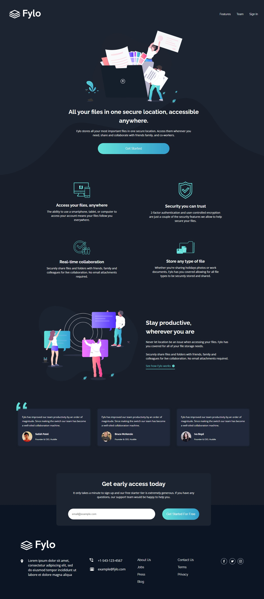

<h1 align="center">Fylo Dark Theme Landing Page Master</h1>

<h3 align="justify">Esse projeto é um desafio do site <a href="https://www.frontendmentor.io/">Frontend Mentor</a>. Esse programa (Fylo Dark Theme Landing Page Master) foi desenvolvido com o objetivo de praticar e consolidar conhecimentos.</h3>

 

  

## Tópicos

- [Imagem do projeto](#img)
- [Acesso ao projeto](#acesso)
- [Descrição do projeto](#desc)
- [Tecnologias utilizadas](#tec)
- [Status do projeto](#status)
- [Desenvolvedor do projeto](#dev)
- [Licença](#license)

 

<h2 id="img">🖥️ Imagem do projeto</h2>

    

 

<h2 id="acesso">⚓ Acesso ao projeto</h2>

Acesse o projeto clicando [aqui](https://fel1324.github.io/Fylo-Dark-Theme-Landing-Page-Master/)

 

<h2 id="desc">💻 Descrição do projeto</h2>

    O Fylo tem a proposta de armazenar todos os seus arquivos mais importantes em um local seguro. Acesse-os sempre que precisar, compartilhe e colabore com amigos, família e colegas de trabalho.

 

<h2 id="tec">🛠️ Tecnologias utilizadas</h2>

* HTML
* CSS
* Git e Github

 

<h2 id="status">🚧 Status do projeto</h2>

✔️ Projeto Finalizado

 

<h2 id="dev">👨‍💻 Desenvolvedor do projeto</h2>

* Rafael Roberto de Oliveira

 

<h2 id="license">📝 Licença</h2>

Esse projeto está sob a licença MIT.